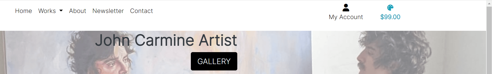

# JC Artist Gallery

## Contents

- [User Experience](#user-experience)
    * [User Stories](#user-stories)

- [Design](#design)
    * [Colour Scheme](#colour-scheme)
    * [Typography](#typography)
    * [Imagery](#imagery)
    * [Wireframes](#wireframes)
    * [Database Schema](#database-schema)
- [Features](#features)
    * [Home Page](#home-page)
    * [Artwork Page](#artwork-page)
    * [Artwork Detail Page](#artwork-detail-page)
    * [About Page](#about-page)
    * [Newsletter Page](#newsletter-page)
    * [Contact Page](#contact-page)
    * [Bag Page](#bag-page)
    * [Checkout Page](#checkout-page)
    * [My Profile Page](#my-profile-page)
    * 
    * 
    * 
    * 

- [Technologies](#technologies)
    *
    *
- [Deployment](#deployment)

- [Credits](#credits)

## User Experience

JC Artist Gallery is a site which allows users to browse works of art by an Artist, and then buy them if desired. Users can create an account, and sign up for a newsletter. The likely visitors to the website are people who are interested in art by this particular artist - they may have found out about him at an exhibition. They may also have searched for art by local artists in the Bristol area.

## User Stories

You can find all of the user stories by clicking [here](https://github.com/Robn88/jc-artist-gallery/issues)

### EPIC - Viewing and Navigation

- As a shopper I can mouse over the image and see it zoomed in so that I can see in high detail the painting and the brushstrokes. **Not yet implemented**
- As a shopper I can search for a piece of art by category so that I can find what I am looking for quickly. **Not yet implemented**
- As a shopper I can easily see the current cost of items selected to purchase so that I know how much I am currently set to spend at the checkout.

- The first two of these user stories haven't been implemented yet. This is because they although they would be useful to have, they aren't critical to the site in its current state. For example, searching by categories would be very useful if there were many pieces of art by many different artists. However, with so few pieces currently available, it makes little sense to implement this feature. There is also the notion that visitors to a gallery in person go to browse, and not to purposefully buy a particular piece of art: if they are seduced by a piece, then they may consider buying it.

### EPIC - Registration and User Accounts

- As a site user I can have a personalized user profile so that I can see my order history, edit my personal information, and add my payment details.

- As a site user I can receive an email when creating my account so that I can be sure that my account creation was successful.

- As a site user I can easily log in and log out so that I can access my account.

### EPIC - Purchasing and Checkout

- As a shopper I can receive an email after making my purchase so that I can refer to this in the future.

- As a shopper I can view an order confirmation after checkout so that I can be sure there are no mistakes.

- As a shopper I can know that my personal information is being treated securely so that make a purchase with confidence.

- As a shopper I can easily enter my payment details so that I can check out quickly.

- As a shopper I can see the artwork that I have selected to buy so that I can see the total cost and how many items I have added to the bag.

### EPIC - Admin and Store Management

- As a store owner I can easily add new artwork to the store so that the store always has enough artwork for sale.

- As a store owner I can easily modify the details of artwork so that I can correct any errors in the description, or change the image for another one.

- As a store owner I can add a sold tag to artwork so that if it has been sold, it no longer appears for sale.

### EPIC - Wishlist

- As a shopper I can easily add artwork to my wishlist so that I can find a list of all the artwork which I have added to my wishlist. **Not yet implemented**

- As a shopper I can easily view the artwork in my wishlist so that I can then choose to purchase it without having to search for it again. **Not yet implemented**

- The Wishlist has not yet been implemented, as it is not essential to the core store functionality. While this would be a nice feature to have in the future, it not necessary for users in the site's current state.

[Back to top ⇧](#jc-artist-gallery)

## Design

Overall, many parts of the site, such as the header, the view artwork page, as well as the checkout and view bag pages, are inspired by the Code Institute Boutique Ado walkthrough project.

### Colour Scheme

- The colour scheme is minimalist, essentially composed of white, with buttons in black to provide a contrast. I wanted to recreate as much as possible the feel of being in a gallery, and the idea of paintings on blank walls. The goal was for the site to be as visually sparse when it comes to viewing art as possible. There are exceptions, for the background images on other pages, which I will go into more detail on below. 

### Typography

- I have used the font 'Inter' from Google Fonts. Although I toyed with the idea of using something more artistic, that mimicked in some way an artist's brushstroke, or the signature on a painting, I discarded these as being too distracting, and gimmicky. Again, I wanted the focus to be on the Art, and not some wacky font; when one thinks of a plaque that accompanies a painting in a gallery, its goal is to inform, not distract.

### Imagery

- The images of the artwork currently displayed are naturally placeholders. Despite John Carmine's obvious talent, he has not (as of yet) painted either the Mona Lisa or Vase with Fifteen Sunflowers. The images are, perhaps, the most important part of the site - they should, when seen in the artwork page, entice users to click on them, to see them in more detail. I wanted my users to imagine themselves being in a gallery, and clicking on a piece that drew their eyes, rather than being in an e-commerce store.

- Regarding the background images, which can currently be found on the index, contact, about and newsletter pages. Using works of art as background images, and applying CSS to them in order to make the content above them be easily readable, was a choice that I made to reinforce the artistic nature of the site. I especially feel that the hero image on the front page makes a very strong visual impact.

### Wireframes

- 

### Database Schema

## Features

### Home Page

#### Nav Bar

- The nav bar is located at the top of the page, and provides quick and easy navigation to the key areas of the site. It is visible on every page of the site, and is responsive, so on smaller screens, it will adjust its size and become a hamburger button.

#### Hero Image

- The hero image provides the background for the landing page. It also has a title, which immediately explains to users what the page is about, and a call to action button, so users can jump straight into the gallery page.

### Artwork Page

#### Gallery

- Depending on the screen size, a number of different pieces of art are displayed. On smaller screens, only 1 will be displayed. Each piece of art is displayed with its title below. Mousing over the image will change the cursor to a link pointer, so it is obvious that this will link to the piece of art. 

[Back to top ⇧](#jc-artist-gallery)

### Artwork Detail Page

#### Individual Artwork

- Each piece of art has its own page, with a larger picture of the piece of art on the left of the screen, and some information accompanying it. Every piece of art must have the following fields: a category, technique, name, dimensions, description, and price. There are some optional fields, too: the artist's name, whether or not it is framed, and the price if it is framed. All of this information is displayed to the right of the work of art, and below the painting if on smaller devices. I displayed it like this to evoke the feeling of being in a gallery.

### About Page

- The about page has a brief description of the artist, and a link to his instagram profile, which can be reached by clicking on the icon. The background image is of a piece of abstract art, which adds some colour to the page, without being too visually distracting. As this page is distinct from the gallery, I feel that it is appropriate to abandon the strict white background.

### Newsletter Page

- The newsletter page is a simple page, which invites users to sign up for a newsletter by entering their email address. The black submit button is consistent with other buttons across the site. There is also another piece of abstract art as a background image, different from that of the about page, which again adds colour, without being too visually distracting.

### Contact Page

- The contact page allows site users to send a message to the site owner, with a subject and a body. There is a brief description above the form, with some ideas for common queries. The background image adds some colour, and the whitespaces on the form contrast well with it.

### Bag Page

- The bag page can be accessed at any time by clicking on the artist's palette icon on the top right of the navbar, or by clicking the secure checkout button after adding a piece of art to the bag. This page will display a list of the pictures and titles of all of the pieces of art currently in the bag, along with their price, and an option to remove it from the bag. Two buttons in the bottom right give users the option to return to the gallery, or to proceed to the secure checkout.

### Checkout Page

- The checkout page will allow users to fill in their personal information and payment details via a form on the left-hand side of the screen. On the right-hand side of the screen, an order summary is shown to users, similar to that of the bag page. A button at the bottom allows users to pay, while another gives users the option to return to the gallery. The minimalist white background styling applies here, as I do not want users to be distracted by anything else when they are on this page.

### My Profile Page

- This page allows a logged in user to view their default delivery information, as well as an order history. Users can update their details by changing the values in the form, then submitting them via a button on the bottom. The order history displays the list of purchases that a user has made. They can get more detailed information by clicking on the first 5 characters of the order number, which are presented as blue links, to make them obvious.

## Technologies

## Deployment

## Credits