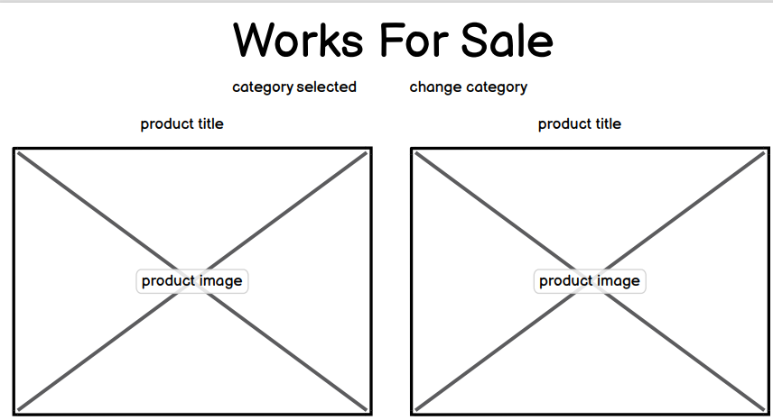

# JC Artist Gallery

## Contents

- [User Experience](#user-experience)
    * [User Stories](#user-stories)

- [Design](#design)
    * [Colour Scheme](#colour-scheme)
    * [Typography](#typography)
    * [Imagery](#imagery)
    * [Wireframes](#wireframes)
    * [Database Schema](#database-schema)
- [Features](#features)
    * [Home Page](#home-page)
    * [Artwork Page](#artwork-page)
    * [Artwork Detail Page](#artwork-detail-page)
    * [About Page](#about-page)
    * [Newsletter Page](#newsletter-page)
    * [Contact Page](#contact-page)
    * [Bag Page](#bag-page)
    * [Checkout Page](#checkout-page)
    * [Checkout Success page](#checkout-success-page)
    * [My Profile Page](#my-profile-page)
    * [Order History Page](#order-history-page)
- [Future Features](#future-features)

- [Technologies](#technologies)
    * [Languages](#languages)
    * [Libraries and Programs](#libraries-and-programs)
- [Deployment](#deployment)

- [Credits](#credits)

## User Experience

JC Artist Gallery is a site which allows users to browse works of art by an Artist, and then buy them if desired. Users can create an account, and sign up for a newsletter. The likely visitors to the website are people who are interested in art by this particular artist - they may have found out about him at an exhibition. They may also have searched for art by local artists in the Bristol area.

[Back to top ⇧](#jc-artist-gallery)

## User Stories

You can find all of the user stories by clicking [here](https://github.com/Robn88/jc-artist-gallery/issues)

### EPIC - Viewing and Navigation

- As a shopper I can mouse over the image and see it zoomed in so that I can see in high detail the painting and the brushstrokes. **Not yet implemented**
- As a shopper I can search for a piece of art by category so that I can find what I am looking for quickly. **Not yet implemented**
- As a shopper I can easily see the current cost of items selected to purchase so that I know how much I am currently set to spend at the checkout.

- The first two of these user stories haven't been implemented yet. This is because they although they would be useful to have, they aren't critical to the site in its current state. For example, searching by categories would be very useful if there were many pieces of art by many different artists. However, with so few pieces currently available, it makes little sense to implement this feature. There is also the notion that visitors to a gallery in person go to browse, and not to purposefully buy a particular piece of art: if they are seduced by a piece, then they may consider buying it.

### EPIC - Registration and User Accounts

- As a site user I can have a personalized user profile so that I can see my order history, edit my personal information, and add my payment details.

- As a site user I can receive an email when creating my account so that I can be sure that my account creation was successful.

- As a site user I can easily log in and log out so that I can access my account.

### EPIC - Purchasing and Checkout

- As a shopper I can receive an email after making my purchase so that I can refer to this in the future.

- As a shopper I can view an order confirmation after checkout so that I can be sure there are no mistakes.

- As a shopper I can know that my personal information is being treated securely so that make a purchase with confidence.

- As a shopper I can easily enter my payment details so that I can check out quickly.

- As a shopper I can see the artwork that I have selected to buy so that I can see the total cost and how many items I have added to the bag.

### EPIC - Admin and Store Management

- As a store owner I can easily add new artwork to the store so that the store always has enough artwork for sale.

- As a store owner I can easily modify the details of artwork so that I can correct any errors in the description, or change the image for another one.

- As a store owner I can add a sold tag to artwork so that if it has been sold, it no longer appears for sale.

### EPIC - Wishlist

- As a shopper I can easily add artwork to my wishlist so that I can find a list of all the artwork which I have added to my wishlist. **Not yet implemented**

- As a shopper I can easily view the artwork in my wishlist so that I can then choose to purchase it without having to search for it again. **Not yet implemented**

- The Wishlist has not yet been implemented, as it is not essential to the core store functionality. While this would be a nice feature to have in the future, it not necessary for users in the site's current state.

[Back to top ⇧](#jc-artist-gallery)

## Design

Overall, many parts of the site, such as the header, the view artwork page, as well as the checkout and view bag pages, are inspired by the Code Institute Boutique Ado walkthrough project.

### Colour Scheme

- The colour scheme is minimalist, essentially composed of white, with buttons in black to provide a contrast. I wanted to recreate as much as possible the feel of being in a gallery, and the idea of paintings on blank walls. The goal was for the site to be as visually sparse when it comes to viewing art as possible. There are exceptions, for the background images on other pages, which I will go into more detail on below. 

### Typography

- I have used the font 'Inter' from Google Fonts. Although I toyed with the idea of using something more artistic, that mimicked in some way an artist's brushstroke, or the signature on a painting, I discarded these as being too distracting, and gimmicky. Again, I wanted the focus to be on the Art, and not some wacky font; when one thinks of a plaque that accompanies a painting in a gallery, its goal is to inform, not distract.

### Imagery

- The images of the artwork currently displayed are naturally placeholders. Despite John Carmine's obvious talent, he has not (as of yet) painted either the Mona Lisa or Vase with Fifteen Sunflowers. The images are, perhaps, the most important part of the site - they should, when seen in the artwork page, entice users to click on them, to see them in more detail. I wanted my users to imagine themselves being in a gallery, and clicking on a piece that drew their eyes, rather than being in an e-commerce store.

- Regarding the background images, which can currently be found on the index, contact, about and newsletter pages. Using works of art as background images, and applying CSS to them in order to make the content above them be easily readable, was a choice that I made to reinforce the artistic nature of the site. I especially feel that the hero image on the front page makes a very strong visual impact.

[Back to top ⇧](#jc-artist-gallery)

### Wireframes

#### Home Page

- My initial plan for the home page was to have a transparent header, and just have the links floating on top of the background hero image. However, I abandoned this idea in favour of a fixed, white navbar. I did this for a number of reasons, chiefly because there wasn't enough contrast between the anchor links and the background, and a plain white background looked better. I also abandoned the idea of having a carousel early on: in the end, I found that using one background image had a stronger effect. I also neglected to include icons for both the account and 'bag', which in the finished project is represented by an artist's palette instead.

#### Artwork

- My original idea for the artwork view was to display only two pieces per page on large screens. However, I also changed my mind, as I wanted users to be enticed by the image, and then to click on it to see it in higher quality. Therefore, having smaller images would be more likely to draw users in. I also did not implement sorting by category, as I felt that this detracted from the feel of the site as a gallery, and with so few pieces of art all by the same artist, it ultimately was not necessary at this point in the project.

#### Artwork detail

- The artwork detail page ultimately ended up being the most similar to the wireframe. I had a clear idea of how the art should be presented, taking center stage, with the description and details on the right.

[Back to top ⇧](#jc-artist-gallery)

### Database Schema

This is the entity relationship diagram for my data:

## Features

### Home Page

#### Nav Bar

- The nav bar is located at the top of the page, and provides quick and easy navigation to the key areas of the site. It is visible on every page of the site, and is responsive, so on smaller screens, it will adjust its size and become a hamburger button.

#### Hero Image

- The hero image provides the background for the landing page. It also has a title, which immediately explains to users what the page is about, and a call to action button, so users can jump straight into the gallery page.

### Artwork Page

#### Gallery

- Depending on the screen size, a number of different pieces of art are displayed. On smaller screens, only 1 will be displayed. Each piece of art is displayed with its title below. Mousing over the image will change the cursor to a link pointer, so it is obvious that this will link to the piece of art. 

[Back to top ⇧](#jc-artist-gallery)

### Artwork Detail Page

#### Individual Artwork

- Each piece of art has its own page, with a larger picture of the piece of art on the left of the screen, and some information accompanying it. Every piece of art must have the following fields: a category, technique, name, dimensions, description, and price. There are some optional fields, too: the artist's name, whether or not it is framed, and the price if it is framed. All of this information is displayed to the right of the work of art, and below the painting if on smaller devices. I displayed it like this to evoke the feeling of being in a gallery.

### About Page

- The about page has a brief description of the artist, and a link to his instagram profile, which can be reached by clicking on the icon. The background image is of a piece of abstract art, which adds some colour to the page, without being too visually distracting. As this page is distinct from the gallery, I feel that it is appropriate to abandon the strict white background.

### Newsletter Page

- The newsletter page is a simple page, which invites users to sign up for a newsletter by entering their email address. The black submit button is consistent with other buttons across the site. There is also another piece of abstract art as a background image, different from that of the about page, which again adds colour, without being too visually distracting.

### Contact Page

- The contact page allows site users to send a message to the site owner, with a subject and a body. There is a brief description above the form, with some ideas for common queries. The background image adds some colour, and the whitespaces on the form contrast well with it.

### Bag Page

- The bag page can be accessed at any time by clicking on the artist's palette icon on the top right of the navbar, or by clicking the secure checkout button after adding a piece of art to the bag. This page will display a list of the pictures and titles of all of the pieces of art currently in the bag, along with their price, and an option to remove it from the bag. Two buttons in the bottom right give users the option to return to the gallery, or to proceed to the secure checkout.

### Checkout Page

- The checkout page will allow users to fill in their personal information and payment details via a form on the left-hand side of the screen. On the right-hand side of the screen, an order summary is shown to users, similar to that of the bag page. A button at the bottom allows users to pay, while another gives users the option to return to the gallery. The minimalist white background styling applies here, as I do not want users to be distracted by anything else when they are on this page.

### Checkout Success Page

- The checkout success page is displayed upon a successful transaction. A message appears from the top, and automatically disappears after a few seconds. This page offers users a summary of their purchase,a nd follows the same minimalist approach to the checkout page.

### My Profile Page

- This page allows a logged in user to view their default delivery information, as well as an order history. Users can update their details by changing the values in the form, then submitting them via a button on the bottom. The order history displays the list of purchases that a user has made. They can get more detailed information by clicking on the first 5 characters of the order number, which are presented as blue links, to make them obvious.

### Order History Page

- The order history page can be reached by clicking on one of the blue links detailed above. This essentially provides the same information that is displayed on the checkout success page.

[Back to top ⇧](#jc-artist-gallery)

## Future Features

- 

## Web Marketing

### Facebook Business Page

I have not created a Facebook page for this site, but I have created a mockup of what a site may look like below:

### Web Marketing Strategy

- If I were to use a strategy to help market this site to others, I would opt for an organic, social media marketing campaign. The reasons for this are many:
    1. Many artists, while independent, organise themselves into collectives, based perhaps on geography. In Bristol alone, there are many collectives, putting on events and exhibitions. An artist could get more publicity joining one of these collectives, and having links to their site here, which see a lot more traffic than indiviudal artist sites.

    2. I feel that people wanting to buy art don't go looking for a specific piece to buy - they prefer to browse and see if a particular piece jumps out at them. Most people would also prefer to see a piece of art in real life before committing to buying it. Therefore, paid advertising would have a very low success rate compared to someone who, say, is looking to buy a piece of furniture.

    3. One of the other benefits of social media marketing is the ability to connect with your audience, by sharing works in progress, or asking for ideas and feedback. Given that most social media encourages the sharing of photos, this would work fantastically well in tandem with an Artist. The ability to share pictures, and then for followers to potentially share them on, could be a very good way to create interest and business.

    4. Social media marketing has one other crucial advantage - it's free! Given that relatively few artists make a living purely from selling their own work, it is unlikely that the website owner would have money to spend on advertising.

### SEO Optimization

For the SEO optimization, after doing some research using [word tracker](https://www.wordtracker.com/) I settled on some recurring words : gallery, artist, art, local, and Bristol. These were the words that yielded the most success, and the most results.

## Technologies

### Languages

- HTML5

- CSS3

- JavaScript

- Python

### Libraries and Programs

- [Django](https://www.djangoproject.com/)
    - The Django framework was used to build the site using the model, view template architecture.

- [Bootstrap](https://getbootstrap.com/)
    - The Bootstrap framework was used to build and style the website easily.

- [Jquery](https://jquery.com/)
    - Used to facilitate HTML DOM tree traversal and manipulation, as well as event handling.

- [Git](https://git-scm.com/)
    - Used for version control.

- [Github](https://github.com/)
    - Used to host the repository.

- [Gitpod](https://www.gitpod.io/)
    - The development environment, where the site was built.

- [Google fonts](https://fonts.google.com/about)
    - The font used on the website was taken from here.

- [Font Awesome](https://fontawesome.com/)
    - The fonts used on the site were obtained from this site.

- [PostgreSQL](https://www.postgresql.org/)
    - This was the database used for the project.

- [Balsamiq](https://balsamiq.com/)
    - This software was used to create the wireframes.

- [AWS](https://aws.amazon.com/s3/)
    - An AWS s3 bucket was used to host the static files for the project.

- [Stripe](https://stripe.com/gb)
    - Stripe was used to process the payments for the project.

- [Heroku](https://www.heroku.com/)
    - The website was deployed using Heroku.

- [TinyPNG](https://tinypng.com/)
    - TinyPNG was used to compress the images to make the website load faster.

- [Pexels](https://www.pexels.com/)
    - Pexels was used to find royalty-free images to use on the site.

- [Lucidchart](https://lucid.co/)
    - Lucidchat was used to make the ERD in this readme.

[Back to top ⇧](#jc-artist-gallery)

## Deployment

- This project was deployed using Github and Heroku. The live deployed application can be found at [JC Artist](https://jc-artist.herokuapp.com/). This was how it was accomplished:

    1. First, I logged in to Heroku, then on the dashboard, clicked on the 'new' button. A dropdown menu appears, and you click on 'create new app'.

    2. I then chose a name for my app, in this case jc-artist, and set the region to Europe.

    3. I then clicked on the resources tab,and under resources, searched for Heroku Postgres.

    4. Having selected the database, I then had to choose which plan to use. In my case, I chose Hobby dev, as it is free.

    5. Having done this, I then navigated to the settings tab, and clicking on the reveal config vars, I obtained the Database URL.

    6. Returning now to Gipod, I create a file called env.py in the base directory.

    7. In env.py, I then created an environment variable as can be seen below:

    os.environ["DATABASE_URL"] = " "

    I then put the value from the DATABASE_URL Config Var between the double quotes.

    8. In env.py, I then created a new environment variable for the secret key, as can be seen below:

    os.environ["SECRET_KEY"] = " "

    I then created my own secret key and put it between the double quotes.

    9. I then returned to the settings section of Heroku, and created a new Config Var called SECRET_KEY, and assigned it the same value as in stage 8.

    10. Next, I opened settings.py and added the following code:

    

    This is to prevent the application from throwing an error if it is unable to find the file, since it won't exist in production.

    11. In settings.py, I then changed the insecure key to the path to the newly created secret key.

    12. Again, in settings.py, I created a python dictionary to connect the database to the application.

    

    13. Returning to Heroku, I now added a new Config Var called DIASBLE_COLLECTSTATIC, and set its value to 1. This was only to allow the project to be deployed, and would be subsequently deleted.

    14. I then returned to settings.py in the application and added the following code:

    

    15. It was then necessary to add [TEMPLATES_DIR] to the DIRS section of TEMPLATES in settings.py:

    

    16. Before it could be deployed, the application had to be added to ALLOWED_HOSTS. This consisted of putting the app name, followed by .herokuapp.com. I also put 'localhost', in order to allow me to run the project locally.

    17. The next step was to create the Procfile, in the base directory of the app. The purpose of this was to declare to Heroku that my application would accept http traffic, and to use Gunicorn, the production web server.

    18. Following that, I added and committed the files to my GitHub repository.

    19. Once this was done, I returned to Heroku, and clicked on the Deploy tab. I then selected GitHub as the deployment method.

    20. When I had connected my GitHub account, I then used the search function and found the name of my repository. I then clicked on deploy branch to deploy my project.

[Back to top ⇧](#jc-artist-gallery)

### Local Deployment

*Gitpod* IDE was used to write the code for this project.

To make a local copy of this repository, you can clone the project by typing the follow into your IDE terminal:
- `git clone https://github.com/Robn88/jc-artist-gallery.git`

You can install this project's requirements (where applicable) using: `pip3 install -r requirements.txt`.

Alternatively, if using Gitpod, you can click below to create your own workspace using this repository.

[Back to top ⇧](#jc-artist-gallery)

## Credits

### Code

- A large part of this site is inspired by the [Boutique Ado](https://github.com/Code-Institute-Solutions/boutique_ado_v1/tree/250e2c2b8e43cccb56b4721cd8a8bd4de6686546) walkthrough project by code institute. The following parts of the site are taken from that project, sometimes with minimal changes, such as renaming variables:
    - The checkout app is an almost exact copy;
    - The profiles app is also very similar;
    - The bag app is also almost an exact copy;
    - The views and admin in the Artwork app also follow the Boutique Ado solution.

- I learned how to make a newsletter app by following [this video](https://www.youtube.com/watch?v=TBVsILIt4HM&ab_channel=MasterCodeOnline)

- I spent a <em>lot</em> of time on the documentation for bootstrap and django.

- The CSS for the messages was given to me by my mentor Tim. It can be found on line 147 of static/css/base.css

- I consulted the forums of [Stack Overflow](https://stackoverflow.com/) frequently when faced with problems. I also consulted the Code Institute slack community often in order to find solutions to common problems.

### Media

- The following images were found on Pexels:
    - The background image on the newsletter page can be found [here](https://www.pexels.com/photo/blue-shade-painting-1762973/)

    - The background image on the contact page can be found [here](https://www.pexels.com/photo/photo-of-red-and-blue-abstract-painting-3530054/)

    - The background image on the about page can be found [here](https://www.pexels.com/photo/abstract-painting-1234853/)

    - The background image on the 404 page can be found [here](https://www.pexels.com/photo/red-paint-on-white-wall-6757684/)

- All of the pictures of Art available in the store were taken from their respective wikipedia pages, apart from [Still Life with Flowers and Fruit](https://www.getty.edu/art/collection/object/103RF8)

- The background image on the home page was taken from [here](https://medium.com/sharks-and-spades/artist-paints-himself-painting-himself-painting-himself-painting-himself-ed11017d25fc)

