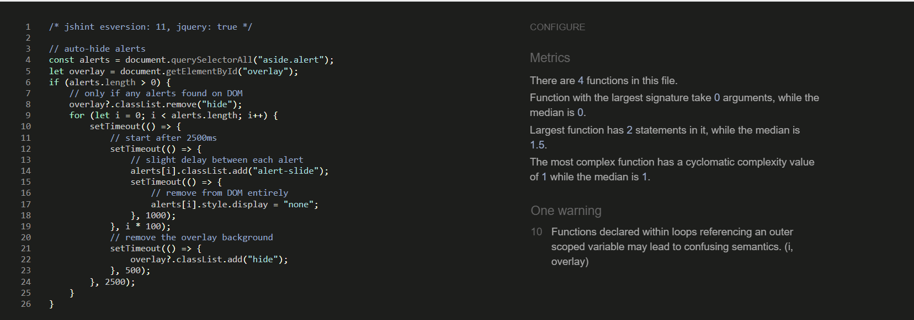

# JC Artist Gallery - Testing

## Contents

- [Validators](#validators)
- [User Story Testing](#user-story-testing)
- [Feature Testing](#feature-testing)
- [Bugs](#bugs)

## Validators

### HTML

The code for the HTMl has been put through [this website](https://validator.w3.org/). Because of the use of Django template variables in the templates, I have used the compiled HTML obtained from right clicking on each page of the site, and selecting 'View Page Source'. All pages passed through the validator without errors, with the exception of the following pages:

#### Bag

- This error is caused by having a table row which does not have any table cells before the fifth cell. As the table head element had 4 head elements, it expects each row to then put data in the columns. As the source of the error is being used to position the buttons to return to gallery or proceed to checkout, this error does not cause the users any issues.

#### Checkout Success

- This error is caused by setting the role attribute to alert, inside an aside element. However, this does not cause any errors in how the website operates, and the alert message still appears when a user succesfully completes their order, which is the purpose of this code.

#### Order History

- This error is exactly the same as the checkout success page error above.

### CSS

The code for the CSS files has been put through [this website](https://jigsaw.w3.org/css-validator/). No errors were thrown, as evidenced below:

#### Static

#### Profiles

#### Checkout

### Javascript

The code for both of the javascript files has passed through [this website](https://jshint.com/). Comments are below:

#### Static file Javascript

- This validation returns one warning, for declaring a function inside of a loop.

#### Stripe Elements Javascript

- This validation returns one error, that Stripe is not defined. I have not yet been able to understand why this error is being thrown - however, it does not appear to affect the running of the website.

### Python

The code for the python files was tested using [this website](http://pep8online.com/). All code has passed through the validator without errors. You can click on this [link](assets/readme/testing/python) to find screenshots of all of the positive testing. 

## User Story Testing

## Feature Testing

## Bugs