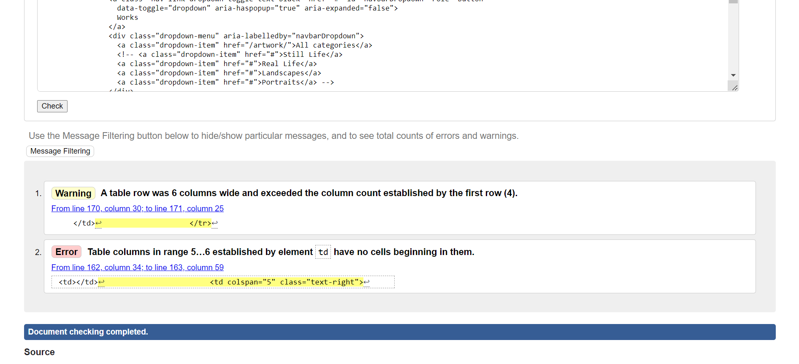

# JC Artist Gallery - Testing

## Contents

- [Validators](#validators)
- [User Story Testing](#user-story-testing)
- [Bugs](#bugs)

## Validators

### HTML

The code for the HTMl has been put through [this website](https://validator.w3.org/). Because of the use of Django template variables in the templates, I have used the compiled HTML obtained from right clicking on each page of the site, and selecting 'View Page Source'. All pages passed through the validator without errors, with the exception of the following pages:

#### Bag

- This error is caused by having a table row which does not have any table cells before the fifth cell. As the table head element had 4 head elements, it expects each row to then put data in the columns. As the source of the error is being used to position the buttons to return to gallery or proceed to checkout, this error does not cause the users any issues.

#### Checkout Success

- This error is caused by setting the role attribute to alert, inside an aside element. However, this does not cause any errors in how the website operates, and the alert message still appears when a user succesfully completes their order, which is the purpose of this code.

#### Order History

- This error is exactly the same as the checkout success page error above.

### CSS

The code for the CSS files has been put through [this website](https://jigsaw.w3.org/css-validator/). No errors were thrown, as evidenced below:

#### Static

#### Profiles

#### Checkout

### Javascript

The code for both of the javascript files has passed through [this website](https://jshint.com/). Comments are below:

#### Static file Javascript

- This validation returns one warning, for declaring a function inside of a loop.

#### Stripe Elements Javascript

- This validation returns one error, that Stripe is not defined. I have not yet been able to understand why this error is being thrown - however, it does not appear to affect the running of the website.

### Python

The code for the python files was tested using [this website](http://pep8online.com/). All code has passed through the validator without errors. You can click on this [link](assets/readme/testing/python) to find screenshots of all of the positive testing. 

## User Story Testing

### EPIC | Navigation

<em>As a shopper I can easily see all the artwork available so that I can find one I am interested in purchasing.</em>

<em>As a shopper I can view an individual piece of art so that I can see information about the piece, such as its price, dimensions, description, and whether or not it is framed.</em>

<em>As a shopper I can easily see the current cost of items selected to purchase so that I know how much I am currently set to spend at the checkout.</em>

### EPIC | Registration and User Accounts

<em>As a site user I can easily register for an account so that I will have a profile that will store all of my personal information and order history.</em>

<em>As a site user I can receive an email when creating my account so that I can be sure that my account creation was successful.</em>

<em>As a site user I can easily log in and log out so that I can access my account.</em>

<em>As a site user I can easily recover my password so that I can regain access to my account.</em>

<em>As a site user I can have a personalized user profile so that I can see my order history, edit my personal information, and add my payment details.</em>

### EPIC | Purchasing and Checkout

<em>As a shopper I can see the artwork that I have selected to buy so that I can see the total cost and how many items I have added to the bag.</em>

<em>As a shopper I can easily enter my payment details so that I can check out quickly.</em>

<em>As a shopper I can know that my personal information is being treated securely so that make a purchase with confidence.</em>

<em>As a shopper I can view an order confirmation after checkout so that I can be sure there are no mistakes.</em>

<em>As a shopper I can receive an email after making my purchase so that I can refer to this in the future.</em>

### EPIC | Admin and Store Management

<em>As a store owner I can easily add new artwork to the store so that the store always has enough artwork for sale.</em>

<em></em>

## Bugs

### Fixed

Documentation for these bugs, with screenshots, can be found [here](https://github.com/Robn88/jc-artist-gallery/issues?q=is%3Aissue+is%3Aclosed).

- During the creation of the contact app, I had a name error. This was as a result of not using inverted commas around POST on line 10 of views.py. In this case, the error message was very clear, and I was able to understand easily my error.

- I also had a name error, where 'redirect' was not defined. Again, this was a simple error to fix, as I knew that redirect is a common import from django shortcuts. Importing this at the top of the file fixed the issue.

- I had a type error, which was caused by having brackets after the declaration of a variable. Removing these brackets fixed the error. I would eventually add the brackets back and give it the parameters of `request.POST, request.FILES`. However, at this point in the project, I wanted to simply render the view, to make sure that the URL was hooked up correctly, before implementing the form.

- I had an error where I had referenced an error before assignment. I had a for loop with a nested if/else statement inside. I created a variable `already_in_bag` inside the if/else statement. However, Python does not allow local variables to be referenced before they have been assigned. The simple fix to this was to create the variable `already_in_bag` before the loop and set its value to `False`.